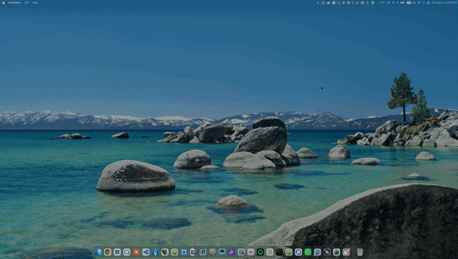

# FortiClient auto-login (macOS)

Fills the FortiClient "Token Code" dialog with the code from the `AuthCode: NNNNNN`
mail in Gmail, clicks OK, and closes the FortiClient window once the VPN is up.
You still click Connect and enter the password yourself; only the token step and
the window cleanup are automated.

## Demo



The token dialog appears, fills itself, and the FortiClient window closes once the
VPN is up. Full-quality recording:
[demo.mov](https://github.com/nachum-shmilovitz-66/forti-auto-login/releases/download/v1.0.0/demo.mov)

## How it works

1. `lib/token-dialog.applescript` polls System Events for a window of any `Forti*`
   process that contains the text "Token Code" and a text field.
2. `lib/gmail-code.applescript` walks every Gmail tab in every Chrome window (each
   Chrome profile has its own cookies) and, from inside the tab, fetches Gmail's
   unread-inbox Atom feed for account indexes `/u/0` to `/u/5`. It keeps the feed whose
   title says `Inbox for <GMAIL_ACCOUNT>`, so extra Google logins, profiles, and
   tabs do not matter. Tabs whose page title names that account are tried first, so it normally
   takes a few seconds regardless of window order or whether the tab shows Chat. Discarded (Memory Saver) tabs are reloaded once. If no tab is signed
   in as that account, `lib/open-gmail.sh` opens Gmail in the Chrome profile whose
   sign-in matches `GMAIL_ACCOUNT` (found in Chrome's `Local State`) and the scan
   runs again. No window needs
   focus. It returns the newest `AuthCode` mail issued after the dialog appeared.
3. The code is typed into the dialog and OK is clicked.
4. `forti-auto-login.sh` waits until a new `utun` address shows up that was not there
   when the dialog appeared (any FortiClient connection, not only PreProd), then
   `lib/close-main-window.applescript` closes the FortiClient window. The app keeps
   running in the menu bar. Set `VPN_IP_PREFIX` (e.g. `10.0.`) to require a specific
   subnet instead.

Nothing leaves the machine; no Google API keys, no stored passwords.

## Setup

One setting is required: the email address that receives the AuthCode mail. Enter
it in the menu bar app under Settings… (opens automatically on first run), or for
the plain script edit the CONFIG block at the top of `forti-auto-login.sh`:

```bash
GMAIL_ACCOUNT=""            # e.g. first.last@example.com
VPN_IP_PREFIX=""            # leave empty; any FortiClient connection
```

Chrome must be signed in to that Google account in some profile. A wrong or
misspelled address fails every dialog with `ERR:no login for ...`. A Gmail tab is
opened at most once per dialog, and never when a signed-in tab exists.

## Usage

```bash
./forti-auto-login.sh --watch     # keep running, handles every token dialog
./forti-auto-login.sh             # one shot: handle the next dialog, then exit
./forti-auto-login.sh --test-gmail   # prints newest AuthCode from the last 24h
./forti-auto-login.sh --dump      # prints FortiClient's accessibility tree (debug)
```

Log: `~/Library/Logs/forti-auto-login.log`. `FC_DEBUG=1 ./forti-auto-login.sh --test-gmail`
traces every Chrome tab tried. Timing tunables via env:
`MAIL_TIMEOUT` (120 s), `CONNECT_TIMEOUT` (90 s), `CLOSE_DELAY` (3 s), `DIALOG_POLL` (1.5 s).

## First run (permissions)

Run `./forti-auto-login.sh --test-gmail` once from Terminal. macOS will ask:

- Terminal -> control "System Events" (Automation) — Allow
- Terminal -> control "Google Chrome" (Automation) — Allow
- Terminal in System Settings > Privacy & Security > Accessibility — must be on

Chrome must have View > Developer > "Allow JavaScript from Apple Events" enabled in
the profile signed in as `GMAIL_ACCOUNT`. Tabs of other
profiles where it is off are skipped, and minimized windows are fine. No Gmail tab needs to be open; the script opens one in
the right profile if needed.

## Menu bar app (optional)

```bash
./make-app.sh
```

Compiles `app/FortiAutoLogin.swift` (needs Xcode command line tools) into
`~/Applications/Forti Auto Login.app`: a shield icon in the menu bar that runs the
watcher as a child process. The script and `lib/` are copied inside the bundle, so
the app is self-contained; rerun `make-app.sh` after editing the scripts. Filled shield = handling a dialog right now. Its menu
shows the last log line and offers Open Log, Restart Watcher, Settings…, Quit.
Settings… is a small window for the email address (validated) and VPN prefix; it
writes `~/.forti-auto-login.conf`, which the script sources after its CONFIG block,
and restarts the watcher. Non-technical colleagues never touch the script. The Finder
icon is FortiClient's own. Grant the same permissions on first launch, then add the
app to System Settings > General > Login Items. Start by hand:

```bash
open -a "Forti Auto Login"
```

Quit from the menu bar icon; that also stops the watcher. Do not run the Terminal
watcher at the same time.

## DMG for colleagues

```bash
./make-dmg.sh              # dist/Forti Auto Login <version>.dmg (version from VERSION)
./make-dmg.sh --notarize   # also notarize + staple (see script header for setup)
```

The DMG holds the self-contained app, an Applications shortcut, and this README.
Colleagues drag the app to Applications, open it, grant Accessibility plus the two
Automation prompts, enable Chrome's "Allow JavaScript from Apple Events" in their
Gmail profile, and add the app to Login Items. Without notarization macOS shows
"Apple could not verify..." on first open; they get past it via System Settings >
Privacy & Security > Open Anyway. The app is signed with a Developer ID
certificate, so permission grants survive updates.

## Releases

Download the latest DMG from
https://github.com/nachum-shmilovitz-66/forti-auto-login/releases.

| Version | Date       | Notes |
|---------|------------|-------|
| 1.0.0   | 2026-09-03 | First release: menu bar app, Settings window with validated email, token dialog auto-fill from Gmail, window auto-close, styled DMG. |

To cut a new release: bump `VERSION`, then

```bash
./make-dmg.sh && gh release create v$(cat VERSION) "dist/Forti Auto Login $(cat VERSION).dmg" --title "Forti Auto Login $(cat VERSION)" --notes "..."
```

Add a row to the table above.

## Status / caveats

- The dialog detection and the fill/OK step were verified against a mock secure-text
  dialog with the same wording. The real FortiClient dialog has not been exercised
  from this repo yet; if it is not picked up, run `--dump` while the dialog is open
  and compare the tree with the finder in `lib/token-dialog.applescript`.
- Gmail's Trusted Types policy blocks `DOMParser` inside the page, so the feed is
  parsed with regex (`lib/gmail-parse.js`).
- `--test-gmail` prints `none` when no **unread** AuthCode mail exists in the last 24 h;
  it prints `ERR:no login for ...` if no Chrome profile is signed in to that mailbox.
- Any FortiClient connection works as long as its mail subject is `AuthCode: NNNNNN`
  (sender is not checked). A different subject format needs the regex in
  `lib/gmail-parse.js` adjusted.
- A code is used once: the issued time of the last used mail is kept in
  `~/.forti-auto-login.last`, so a second dialog never gets the previous code.
- The Gmail feed only lists **unread** inbox mail. Do not open the AuthCode mails
  before the script reads them (you no longer need to).
## Security notes

- This makes the email second factor as strong as the unlocked Mac plus its
  signed-in Chrome session. Anyone at the unlocked machine could connect the VPN.
- Chrome's "Allow JavaScript from Apple Events" lets every app the user has approved
  for Chrome automation run JavaScript in Chrome pages. Enable it only in the Gmail
  profile.
- Nothing leaves the machine. No passwords are stored. The config file holds only the
  email address and VPN prefix and is parsed, never executed; log, state, and config
  files are created mode 600, and one-time codes are masked in the log.
- Any unread inbox mail whose subject is `AuthCode: nnnnnn` is accepted, sender not
  checked; a spoofed mail can make a login fail, not succeed.
- Prefer a notarized DMG (`./make-dmg.sh --notarize`) so users are not trained to
  click "Open Anyway".
